# Architecture Documentation

This document describes the architecture, design decisions, and data flow of the Identus integration suite.

## System Overview

The integration suite is a TypeScript-based system that orchestrates end-to-end testing between Identus components. It manages test execution, result aggregation, report generation, and notification delivery.

## High-Level Architecture

```
┌─────────────────┐
│  GitHub Actions │
│   (Triggers)    │
└────────┬─────────┘
         │
         ▼
┌─────────────────┐
│  Environment     │
│  Generation     │
└────────┬─────────┘
         │
         ▼
┌─────────────────┐
│  Cloud Setup    │
│  (Services)     │
└────────┬─────────┘
         │
         ▼
┌─────────────────┐      ┌──────────────┐      ┌──────────────┐
│   SDK Runners   │──────│  Test        │──────│  Allure      │
│  (Parallel)     │      │  Execution   │      │  Results     │
└────────┬────────┘      └──────────────┘      └──────────────┘
         │
         ▼
┌─────────────────┐
│  Report         │
│  Generation     │
└────────┬─────────┘
         │
         ▼
┌─────────────────┐      ┌──────────────┐
│  GitHub Pages   │      │  Slack       │
│  Deployment     │      │  Notification│
└─────────────────┘      └──────────────┘
```

## Component Architecture

### Directory Structure

```
integration/
├── src/
│   ├── cli/              # Command-line interfaces
│   │   ├── environment.ts
│   │   ├── integration.ts
│   │   ├── report.ts
│   │   └── manual.ts
│   ├── runner/           # Core business logic
│   │   ├── environment.ts # Environment setup
│   │   ├── integration.ts # Integration execution
│   │   ├── report.ts      # Report generation
│   │   └── cloud.ts       # Cloud service setup
│   ├── test-runner/      # SDK-specific runners
│   │   ├── test-runner.ts # Abstract base class
│   │   ├── typescript.ts
│   │   ├── swift.ts
│   │   └── kotlin.ts
│   ├── config/           # Configuration & validation
│   │   ├── validation.ts
│   │   ├── sanitization.ts
│   │   └── manual-validation.ts
│   ├── utils/            # Shared utilities
│   │   └── logger.ts      # Structured logging
│   ├── types.ts           # TypeScript type definitions
│   ├── cmd.ts             # Command execution wrapper
│   └── slack.ts           # Slack notification service
├── tests/                 # Test suite
├── .github/workflows/     # GitHub Actions workflows
└── initial-pages/         # Static pages for GitHub Pages
```

## Data Flow

### Integration Flow

```mermaid
sequenceDiagram
    participant Trigger
    participant EnvGen
    participant Cloud
    participant Runner1
    participant Runner2
    participant Runner3
    participant Report
    participant Pages
    participant Slack

    Trigger->>EnvGen: Dispatch event (component, version)
    EnvGen->>EnvGen: Fetch latest versions
    EnvGen->>EnvGen: Generate environment config
    EnvGen->>Cloud: Setup cloud services
    Cloud->>Cloud: Deploy services
    Cloud->>Runner1: Start SDK tests
    Cloud->>Runner2: Start SDK tests
    Cloud->>Runner3: Start SDK tests
    Runner1->>Report: Allure results
    Runner2->>Report: Allure results
    Runner3->>Report: Allure results
    Report->>Report: Aggregate results
    Report->>Report: Generate Allure report
    Report->>Pages: Deploy report
    Report->>Slack: Send notification (if failed)
```



### Release Flow


## Key Design Decisions

### 1. Parallel Runner Execution

**Decision**: Execute SDK runners in parallel to reduce total execution time.

**Implementation**: 
- Runners are processed using `Promise.all()` for parallel execution
- Results are collected first, then aggregated sequentially to avoid race conditions
- Each runner's results are stored in separate directories before aggregation

**Trade-offs**:
- ✅ Faster execution time
- ✅ Better resource utilization
- ⚠️ More complex error handling
- ⚠️ Requires careful state management

### 2. Environment Variable Encoding

**Decision**: Encode environment configuration as base64 string for GitHub Actions.

**Implementation**:
- Environment object is JSON stringified and base64 encoded
- Passed between workflow jobs via outputs
- Decoded at runtime in report generation

**Rationale**:
- GitHub Actions has limitations on complex data structures in outputs
- Base64 encoding ensures safe transmission
- Allows passing complex nested objects

### 3. Draft Release Cleanup

**Decision**: Automatically remove draft releases when final release is created.

**Implementation**:
- On final release, system checks for `{version}-draft`
- Removes draft directory and manifest entry
- Prevents UI clutter and ensures only final releases are visible

**Rationale**:
- Drafts are temporary validation artifacts
- Final release supersedes draft
- Keeps release history clean

### 4. Structured Logging

**Decision**: Use structured logging with consistent prefixes and context.

**Implementation**:
- Created `src/utils/logger.ts` with log levels
- Consistent prefixes: `[REPORT]`, `[PROCESS RUNNERS]`, `[SLACK]`
- Context information included in logs

**Benefits**:
- Easier debugging and log filtering
- Better observability
- Consistent log format across components

### 5. Type Safety

**Decision**: Replace all `any` types with proper TypeScript interfaces.

**Implementation**:
- Created interfaces in `src/types.ts`:
  - `ReleaseMetadata`
  - `ReleaseManifestEntry`
  - `TestStats`
  - `RunnerError`
  - `SDKEnvironment`
  - `ParsedVersion`

**Benefits**:
- Compile-time error detection
- Better IDE support
- Self-documenting code
- Easier refactoring

## State Management

### Environment Configuration

The environment configuration is the central state object:

```typescript
interface environment {
    component: component
    releaseVersion?: string
    workflow: { runId: number }
    services: {
        agent: serviceConfig
        mediator: serviceConfig
        node: serviceConfig
    }
    runners: {
        "sdk-ts": runnerConfig
        "sdk-kmp": runnerConfig
        "sdk-swift": runnerConfig
    }
}
```

### Report State

Report generation maintains:
- Test statistics (passed, failed, broken, skipped, total)
- Execution status (passed/failed)
- Exception tracking
- Runner-specific results

## Error Handling Strategy

### Error Propagation

1. **Runner Errors**: Caught and aggregated, don't stop other runners
2. **Report Generation Errors**: Caught, logged, trigger Slack notification
3. **Slack Notification Errors**: Re-thrown to ensure visibility

### Error Context

All errors include:
- Component/runner context
- Relevant state information
- Stack traces (when available)
- Error causes (using Error.cause)

## Security Considerations

### Command Injection Prevention

- All commands are sanitized using `sanitizeCommand()`
- Whitelist of allowed commands
- Pattern matching for dangerous characters
- Special handling for npm commands

### Environment Variable Security

- Sensitive values (tokens, webhooks) stored as GitHub Secrets
- Webhook URLs validated and sanitized
- No sensitive data in logs

### Input Validation

- All inputs validated before use
- Version strings validated against patterns
- Component/runner names validated against allowlists

## Performance Optimizations

### Parallel Processing

- Runners execute in parallel
- File operations batched where possible
- Async/await used throughout

### Resource Management

- Temporary directories cleaned up after use
- Old reports pruned (keeps last N reports)
- History files reused for Allure trend analysis

## Extension Points

### Adding a New Runner

1. Create new class extending `TestRunner` in `src/test-runner/`
2. Implement abstract methods:
   - `sdkEnv()`: Return environment variables
   - `prepare()`: Setup dependencies
   - `getTagFromVersion()`: Version to tag mapping
3. Add runner to `runners` array in `src/types.ts`
4. Update environment generation logic if needed

### Adding a New Component

1. Add component to `components` array in `src/types.ts`
2. Update environment generation in `src/runner/environment.ts`
3. Add component-specific logic in `src/runner/report.ts` if needed
4. Update GitHub workflows if component needs special handling

## Testing Strategy

### Unit Tests

- Test individual functions with mocked dependencies
- Focus on business logic and edge cases
- Use Vitest for fast execution

### Integration Tests

- Test full workflows with mocked external services
- Verify data flow between components
- Test error scenarios

### Test Coverage

- Report generation logic
- Environment validation
- Release management
- Error handling paths

## Future Improvements

### Potential Enhancements

1. **Retry Logic**: Add retry for transient failures
2. **Caching**: Cache dependency downloads
3. **Metrics**: Add performance metrics collection
4. **Webhooks**: Support webhook notifications beyond Slack
5. **Dashboard**: Real-time status dashboard
6. **Analytics**: Test result trend analysis

### Technical Debt

1. Kotlin SDK (sdk-kmp) is currently broken - needs investigation
2. Some file operations could be optimized with streams
3. Consider migrating to a more structured logging solution
4. Add rate limiting for external API calls

