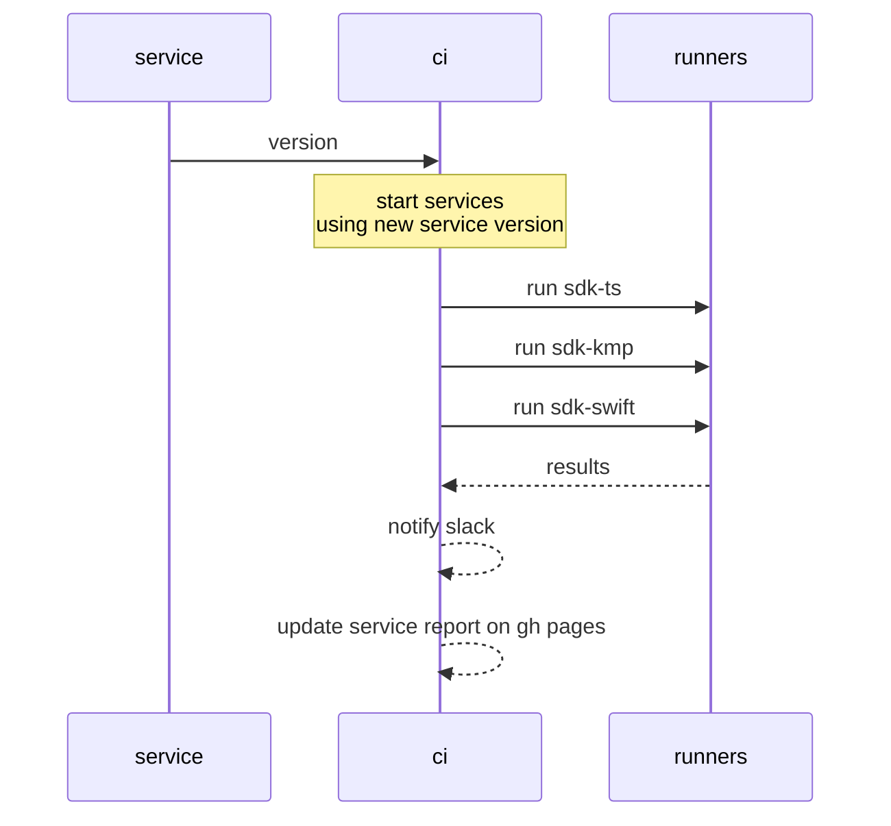
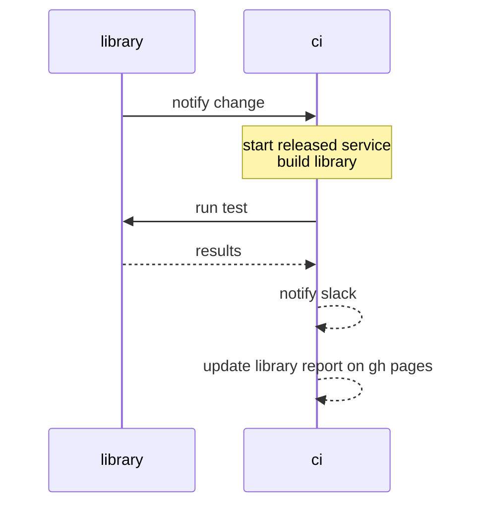

# Identus integration suite

[](https://scorecard.dev/viewer/?uri=github.com/hyperledger-identus/integration)
[](https://opensource.org/licenses/ISC)
[](https://www.typescriptlang.org/)
[](https://nodejs.org/)

This repository aggregates the result of end-to-end test between the new components and stable components.

## Table of Contents

- [Quick Start](#-new-feature-manual-integration-testing)
- [End-to-end Test Matrix](#end-to-end-test-matrix)
- [Usage](#usage)
- [Components](#components)
- [Runners](#runners)
- [Testing](#testing)
- [Development](#development)
- [Architecture](#architecture)
- [Release Flow](#release-flow)
- [Troubleshooting](#troubleshooting)
- [Integration Flows](#integration)

## 🚀 New Feature: Manual Integration Testing

We now support **manual integration testing** that allows developers to trigger custom integration tests with specific component versions. This feature enables:

- **Custom Version Combinations**: Test any combination of component versions
- **Compatibility Validation**: Verify cross-component compatibility
- **Regression Testing**: Ensure existing functionality works with new versions
- **Historical Tracking**: Maintain a compatibility matrix over time

### Quick Start

**Via GitHub Actions** (Recommended):
1. Go to **Actions** → **Manual Integration Tests**
2. Click **"Run workflow"**
3. Select components and enter versions
4. Run the test

**Via CLI**:

```bash
# Auto-detected as "sdk" mode (1 SDK)
npm run manual -- --sdk-ts v1.0.0

# Auto-detected as "all" mode (3 SDKs)
npm run manual -- --sdk-ts v1.0.0 --sdk-swift v2.1.0 --sdk-kmp v0.5.0
```

## End-to-end test matrix

| Flow                                | sdk-ts | sdk-swift | sdk-kmp |
| ----------------------------------- | ------ | --------- | ------- |
| Backup and restorations             | ✔︎      | ✔︎         | ❌       |
| Establish connection                | ✔︎      | ✔︎         | ❌       |
| Receive issued JWT credential       | ✔︎      | ✔︎         | ❌       |
| Receive issued SD-JWT credential    | ✔︎      | ✔︎         | ❌       |
| Receive issued AnonCreds credential | ✔︎      | ✔︎         | ❌       |
| Provide JWT proof                   | ✔︎      | ✔︎         | ❌       |
| Provide SD-JWT proof                | ✔︎      | ✔︎         | ❌       |
| Provide AnonCreds proof             | ✔︎      | ✔︎         | ❌       |
| Receive JWT revocation notification | ✔︎      | ✔︎         | ❌       |
| Verify JWT proof                    | ✔︎      | ✔︎         | ❌       |
| Verify SD-JWT proof                 | ✔︎      | ✔︎         | ❌       |
| Verify AnonCreds proof              | ✔︎      | ✔︎         | ❌       |
| Receive out-of-band JWT credential  | ✔︎      |           | ❌       |
| Provide out-of-band JWT proof       | ✔︎      |           | ❌       |

**Note**: The Kotlin SDK (sdk-kmp) is currently broken and non-functional. Tests are skipped with clear warnings. See PLAN.md for details on the improvement roadmap.

## Testing

This project includes comprehensive unit and integration tests using [Vitest](https://vitest.dev/).

### Running Tests

```bash
# Run all tests
npm test

# Run tests in watch mode
npm run test:watch

# Run tests with coverage
npm run test:coverage
```

### Test Coverage

The test suite covers:
- Report generation and aggregation logic
- Release metadata and manifest management
- Draft release cleanup functionality
- Environment validation
- Slack notification integration
- Error handling and edge cases

See [tests/README.md](tests/README.md) for detailed test documentation.

## Code Quality Improvements

Recent enhancements to the codebase include:

- **Type Safety**: Replaced all `any` types with proper TypeScript interfaces
- **Race Condition Fixes**: Fixed concurrent modification issues in parallel runner processing
- **Error Handling**: Enhanced error messages with context, stack traces, and proper error propagation
- **Code Organization**: Extracted constants, reduced duplication, and improved code structure
- **Logging**: Created structured logging utility for consistent log formatting
- **Documentation**: Added comprehensive JSDoc comments to all public functions

## Development

### Local Development Setup

1. **Clone the repository**
   ```bash
   git clone https://github.com/hyperledger-identus/integration.git
   cd integration
   ```

2. **Install dependencies**
   ```bash
   npm ci
   ```

3. **Set up environment variables**
   ```bash
   cp .env.example .env
   # Edit .env with your configuration
   ```

4. **Run tests**
   ```bash
   npm test
   ```

### Scripts Directory

The `scripts/` directory contains utility scripts for local development and testing:
- `integration-flow.ts`: Manual integration flow script for local testing
- Use these scripts to test integration flows without triggering GitHub Actions

See [CONTRIBUTING.md](CONTRIBUTING.md) for detailed development guidelines.

## Architecture

The integration suite follows a modular architecture:

- **CLI Layer** (`src/cli/`): Command-line interfaces for different operations
- **Runner Layer** (`src/runner/`): Core business logic for integration, reporting, and environment setup
- **Test Runners** (`src/test-runner/`): SDK-specific test execution implementations
- **Configuration** (`src/config/`): Validation, sanitization, and configuration management
- **Utilities** (`src/utils/`): Shared utilities including structured logging

For detailed architecture documentation, see [ARCHITECTURE.md](ARCHITECTURE.md).

## Release Flow

The integration suite supports both draft and final releases:

### Draft Releases
- Triggered when a draft release is created on GitHub
- Version format: `{version}-draft` (e.g., `1.0.0-draft`)
- Reports are generated and stored separately from final releases
- Used for pre-release validation

### Final Releases
- Triggered when a final (non-draft) release is published
- Version format: `{version}` (e.g., `1.0.0`)
- Automatically cleans up corresponding draft release reports
- Updates release manifest with final release information

### Release Cleanup
When a final release is processed:
1. The system checks for a corresponding draft version
2. If found, removes the draft release directory and manifest entry
3. Ensures only final releases appear in the release history

## Troubleshooting

### Common Issues

**Issue: Environment variable not found**
- Ensure `.env` file exists and contains required variables
- Check that `GH_TOKEN` is set for GitHub API access
- Verify `SLACK_WEBHOOK` is set if you want Slack notifications

**Issue: Tests failing locally**
- Ensure all dependencies are installed: `npm ci`
- Check that required environment variables are set
- Verify Node.js version is 20 or higher: `node --version`

**Issue: Workflow failures**
- Check GitHub Actions logs for detailed error messages
- Verify secrets are properly configured in repository settings
- Ensure workflow inputs match expected format

**Issue: Report generation fails**
- Check that Allure results are present in `tmp/` directories
- Verify GitHub Pages deployment permissions
- Check Slack webhook URL format if notifications fail

### Debug Mode

Enable detailed logging by setting:
```bash
export DEBUG=true
```

This will show:
- Detailed command execution logs
- Full error stack traces
- Environment variable values (sanitized)

### Getting Help

- Check [ARCHITECTURE.md](ARCHITECTURE.md) for system design details
- Review [CONTRIBUTING.md](CONTRIBUTING.md) for development guidelines
- See [tests/README.md](tests/README.md) for test documentation

## Usage

```bash
npm ci
npx tsx cli --component {component} --runner {runner}
```

### Environment Setup

Copy the example environment file and configure the required variables:

```bash
cp .env.example .env
# Edit .env with your configuration
```

**Required Environment Variables:**
- `GH_TOKEN`: GitHub token with repository access

**Optional Environment Variables:**
- `SLACK_WEBHOOK`: Slack webhook URL for notifications
- `DEBUG`: Set to `true` for detailed command output
- `EXTERNAL_BASE_URL`: Base URL for external report links (defaults to GitHub Pages URL)
- `CI`: Automatically set in CI environments, enables CI-specific logging

See `.env.example` for detailed configuration options.

### Components

Identus components are:

- [cloud-agent](https://github.com/hyperledger-identus/cloud-agent)
- [mediator](https://github.com/hyperledger-identus/mediator)
- [sdk-ts](https://github.com/hyperledger-identus/sdk-ts)
- [sdk-kmp](https://github.com/hyperledger-identus/sdk-kmp)
- [sdk-swift](https://github.com/hyperledger-identus/sdk-swift)

### Runners

The runners are the SDKs themselves, which runs the end-to-end tests in order to guarantee the platform compatibility.

- sdk-ts
- sdk-kmp
- sdk-swift

### Component testing matrix

The following table describes the artifact versioning and testing for the integration

| component   | cloud-agent | mediator | sdk-ts  | sdk-kmp | sdk-swift |
| ----------- | ----------- | -------- | ------- | ------- | --------- |
| cloud-agent | main        | release  | release | release | release   |
| mediator    | release     | main     | release | release | release   |
| sdk-ts      | release     | release  | main    | -       | -         |
| sdk-kmp     | release     | release  | -       | main    | -         |
| sdk-swift   | release     | release  | -       | -       | main      |

- main: latest changes
- release: latest stable version

### Cronjob testing

In order to test all latest components there's a weekly job.

| environment | cloud-agent | mediator | sdk-ts | sdk-kmp | sdk-swift |
| ----------- | ----------- | -------- | ------ | ------- | --------- |
| weekly      | main        | main     | main   | main    | main      |

## Breaking change flow

When there's an expected breaking change the components will have to be compatible before making a final release. That means the `latest` test should be `green`.

## Integration

### Service integration


### Library integration


## Automatic integration

This event is dispatched when there's a new commit on `main` branch.

```json
{
    "component": "<component>",
    "version": "<version>"
}
```

`Component` should be of of the [list](#components) and `version` for services should've been published or a tag/branch for libraries.