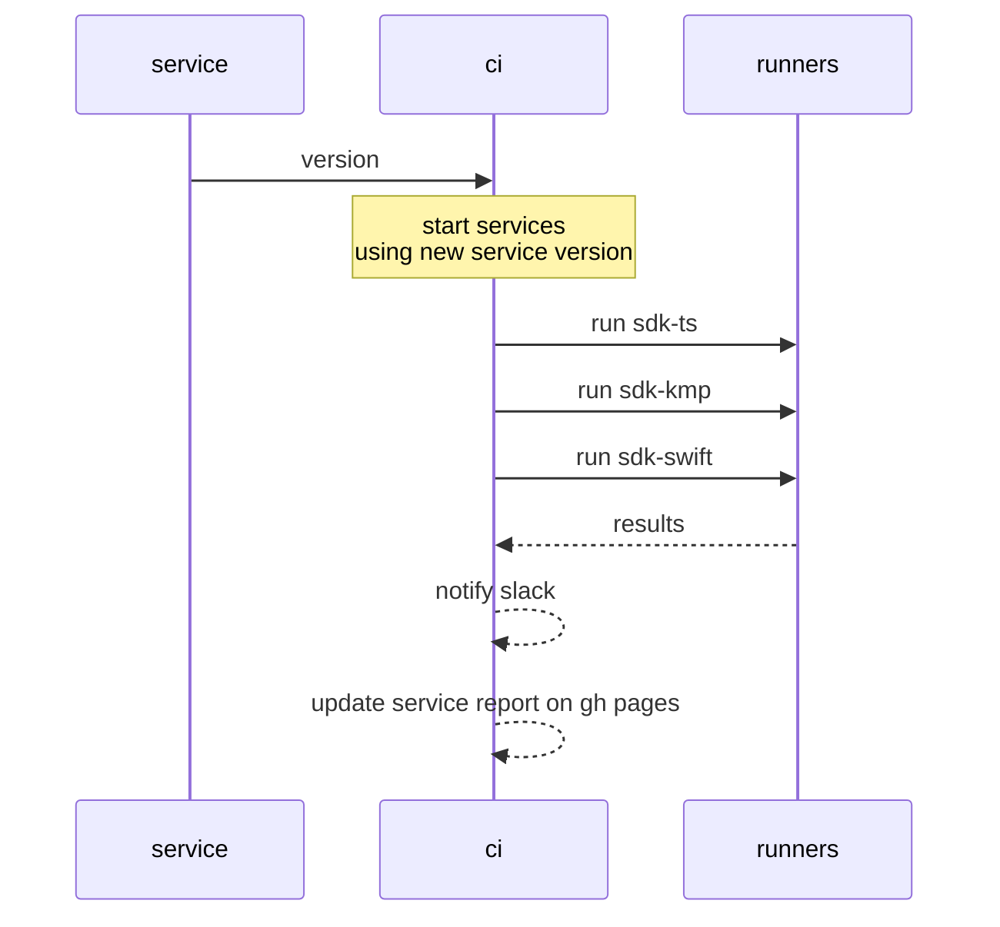
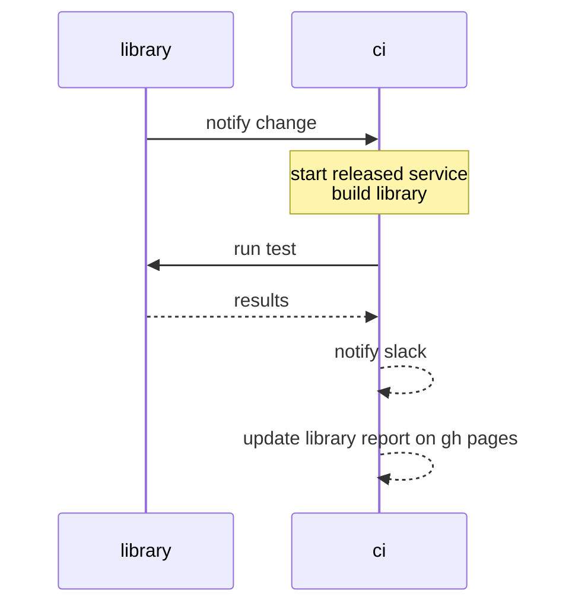

# Identus integration suite

This repository aggregates the result of end-to-end test between the new components and stable components.

## 🚀 New Feature: Manual Integration Testing

We now support **manual integration testing** that allows developers to trigger custom integration tests with specific component versions. This feature enables:

- **Custom Version Combinations**: Test any combination of component versions
- **Compatibility Validation**: Verify cross-component compatibility
- **Regression Testing**: Ensure existing functionality works with new versions
- **Historical Tracking**: Maintain a compatibility matrix over time

### Quick Start

**Via GitHub Actions** (Recommended):
1. Go to **Actions** → **Manual Integration Tests**
2. Click **"Run workflow"**
3. Select components and enter versions
4. Run the test

**Via CLI**:

```bash
# Auto-detected as "sdk" mode (1 SDK)
npm run manual -- --sdk-ts v1.0.0

# Auto-detected as "all" mode (3 SDKs)
npm run manual -- --sdk-ts v1.0.0 --sdk-swift v2.1.0 --sdk-kmp v0.5.0
```

## End-to-end test matrix

| Flow                                | sdk-ts | sdk-swift | sdk-kmp |
| ----------------------------------- | ------ | --------- | ------- |
| Backup and restorations             | ✔︎      | ✔︎         | ❌       |
| Estabilish connection               | ✔︎      | ✔︎         | ❌       |
| Receive issued JWT credential       | ✔︎      | ✔︎         | ❌       |
| Receive issued SD-JWT credential    | ✔︎      | ✔︎         | ❌       |
| Receive issued AnonCreds credential | ✔︎      | ✔︎         | ❌       |
| Provide JWT proof                   | ✔︎      | ✔︎         | ❌       |
| Provide SD-JWT proof                | ✔︎      | ✔︎         | ❌       |
| Provide AnonCreds proof             | ✔︎      | ✔︎         | ❌       |
| Receive JWT revocation notification | ✔︎      | ✔︎         | ❌       |
| Verify JWT proof                    | ✔︎      | ✔︎         | ❌       |
| Verify SD-JWT proof                 | ✔︎      | ✔︎         | ❌       |
| Verify AnonCreds proof              | ✔︎      | ✔︎         | ❌       |
| Receive out-of-band JWT credential  | ✔︎      |           | ❌       |
| Provide out-of-band JWT proof       | ✔︎      |           | ❌       |

**Note**: The Kotlin SDK (sdk-kmp) is currently broken and non-functional. Tests are skipped with clear warnings. See PLAN.md for details on the improvement roadmap.

## Cloud-Agent API matrix

| Method | Endpoint | Description | Covered |
| ------ | -------- | ----------- | ------- |

## Usage

```bash
npm ci
npx tsx cli --component {component} --runner {runner}
```

### Environment Setup

Copy the example environment file and configure the required variables:

```bash
cp .env.example .env
# Edit .env with your configuration
```

**Required Environment Variables:**
- `ENV`: Base64-encoded JSON string with environment configuration
- `GH_TOKEN`: GitHub token with repository access

**Optional Environment Variables:**
- `SLACK_WEBHOOK`: Slack webhook URL for notifications
- `DEBUG`: Set to `true` for detailed command output
- `CI`: Set to `true` for CI mode (disables spinners)

See `.env.example` for detailed configuration options.

### Components

Identus components are:

- [cloud-agent](https://github.com/hyperledger-identus/cloud-agent)
- [mediator](https://github.com/hyperledger-identus/mediator)
- [sdk-ts](https://github.com/hyperledger-identus/sdk-ts)
- [sdk-kmp](https://github.com/hyperledger-identus/sdk-kmp)
- [sdk-swift](https://github.com/hyperledger-identus/sdk-swift)

### Runners

The runners are the SDKs themselves, which runs the end-to-end tests in order to guarantee the platform compatibility.

- sdk-ts
- sdk-kmp
- sdk-swift

### Component testing matrix

The following table describes the artifact versioning and testing for the integration

| component   | cloud-agent | mediator | sdk-ts  | sdk-kmp | sdk-swift |
| ----------- | ----------- | -------- | ------- | ------- | --------- |
| cloud-agent | main        | release  | release | release | release   |
| mediator    | release     | main     | release | release | release   |
| sdk-ts      | release     | release  | main    | -       | -         |
| sdk-kmp     | release     | release  | -       | main    | -         |
| sdk-swift   | release     | release  | -       | -       | main      |

- main: latest changes
- release: latest stable version

### Cronjob testing

In order to test all latest components there's a weekly job.

| environment | cloud-agent | mediator | sdk-ts | sdk-kmp | sdk-swift |
| ----------- | ----------- | -------- | ------ | ------- | --------- |
| weekly      | main        | main     | main   | main    | main      |

## Breaking change flow

When there's an expected breaking change the components will have to be compatible before making a final release. That means the `latest` test should be `green`.

## Integration

### Service integration


### Library integration


## Automatic integration

This event is dispatched when there's a new commit on `main` branch.

```json
{
    "component": "<component>",
    "version": "<version>"
}
```

`Component` should be of of the [list](#components) and `version` for services should've been published or a tag/branch for libraries.