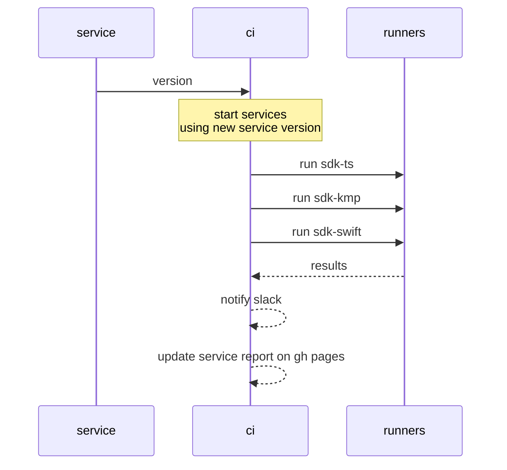
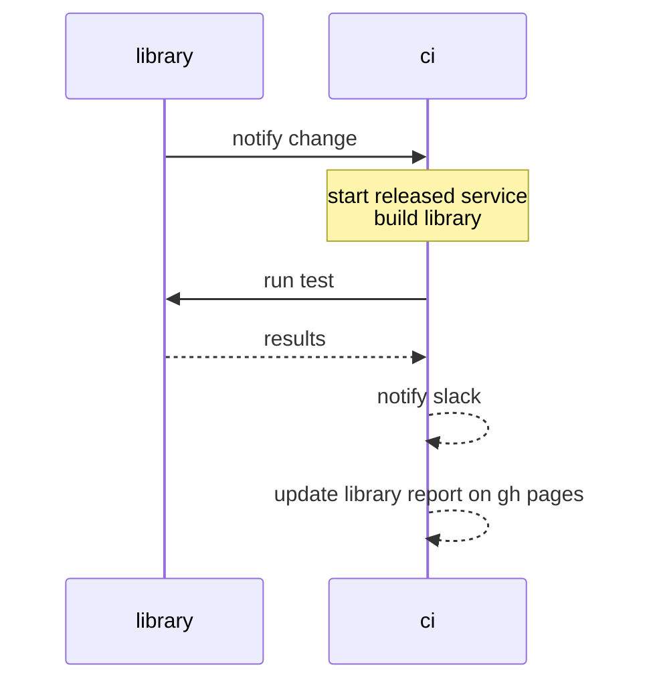

# Identus integration suite

This repository aggregates the result of end-to-end test between the new components and stable components.

## Usage

```bash
npm ci
npx tsx cli --component {component} --runner {runner}
```

### Components

- cloud-agent
- mediator
- sdk-ts
- sdk-kmp
- sdk-swift

### Runners

- sdk-ts
- sdk-kmp
- sdk-swift

### Component testing matrix

The following table describes the artifact versioning and testing for the integration

| component   | cloud-agent | mediator | sdk-ts  | sdk-kmp | sdk-swift |
| ----------- | ----------- | -------- | ------- | ------- | --------- |
| cloud-agent | main        | release  | release | release | release   |
| mediator    | release     | main     | release | release | release   |
| sdk-ts      | release     | release  | main    | -       | -         |
| sdk-kmp     | release     | release  | -       | main    | -         |
| sdk-swift   | release     | release  | -       | -       | main      |

- main: latest changes
- release: latest stable version

### Cronjob testing

In order to test all latest components there's a weekly job

| environment | cloud-agent | mediator | sdk-ts  | sdk-kmp | sdk-swift |
| ----------- | ----------- | -------- | ------- | ------- | --------- |
| weekly      | main        | main     | main    | main    | main      |

## Breaking change flow

When there's an expected breaking change the components will have to be compatible before making a final release. That means the `latest` test should be `green`.

## Integration

### Service integration


### Library integration


## Automatic integration

This event is dispatched when there's a new commit on `main` branch.

```json
{
    "component": "<component>",
    "version": "<version>"
}
```

`Component` should be of of the [list](#components) and `version` for services should've been published or a tag/branch for libraries.